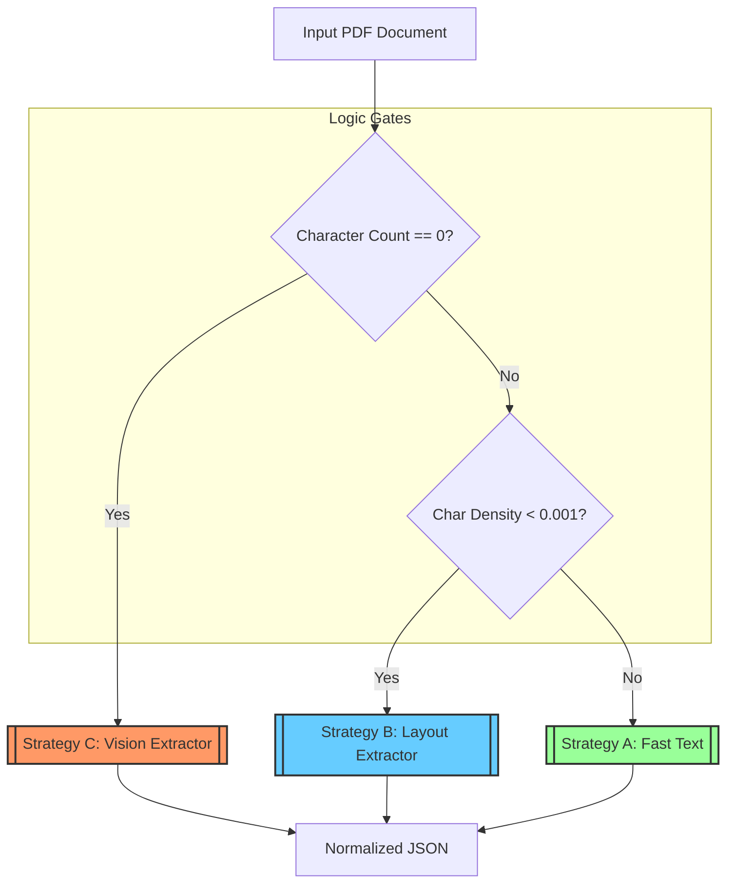
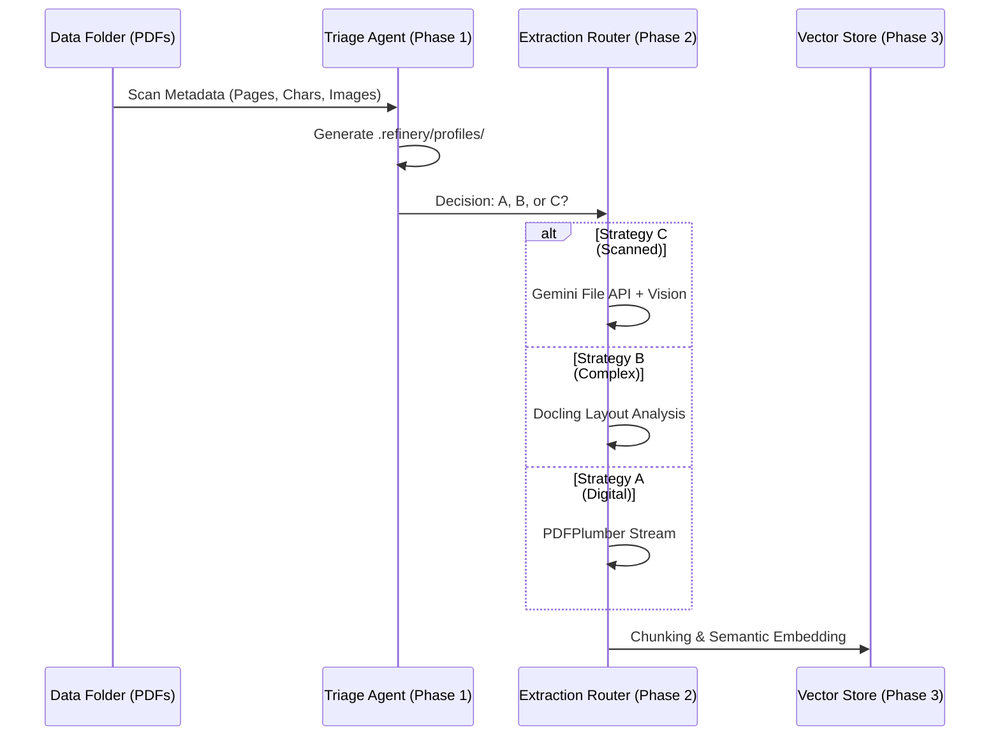

# Phase 0 — Domain Onboarding

## 1. Native vs Scanned PDF Analysis

- Native PDFs (text-extractable): pdfplumber reports non-zero `character_count`, multiple fonts, and sensible `char_density`. These files are safe to extract text from the character stream with spatial provenance preserved by bbox coordinates.
- Scanned PDFs (image-only): pdfplumber reports `character_count=0` on many pages while `number_of_images` is equal to page count or high. These require OCR on the image layer; OCR-only extraction will lose native font information and may collapse structure (tables, columns) if not spatially-aware.
- Immediate practical signal: files with `total_chars==0` and `number_of_images>0` are scanned/image-first; else they're native-text-first.

Observations from the run: several documents show `chars=0 images=pages` patterns (likely scanned), while annual reports and financials show large character counts (native PDF text).

### Docling vs pdfplumber notes

- **Structure extraction**: Docling outputs JSON with explicit `texts`, `tables`, `pictures` arrays and `body` order, making it trivial to identify tables and maintain multi-column reading order. Pdfplumber only gives low-level words and their bboxes; reconstructing tables requires extra heuristics.
- **Tables**: In the sample output (`2018_Audited_Financial_Statement_Report.json`), tables are modeled with cell boundaries and preserved even when spanning columns. Docling's `--tables` model detected them properly, while pdfplumber would require manual post-processing.
- **Multi‑column layouts**: Docling's body ordering followed the natural left‑to‑right, top‑to‑bottom flow; pdfplumber returns word lists sorted by y‑coordinate which can shuffle columns without careful sorting.
- **Figures and captions**: Docling stores images as `pictures` with associated `text` children; captions remain attached by parent references. Pdfplumber gives raw image bboxes without semantic grouping, so captions must be matched heuristically.
- **Reading order**: Docling produces a hierarchical DOM-like structure preserving sequence. Pdfplumber preserves spatial data but leaves order ambiguous, making downstream NER or summarization more error-prone.

These observations will feed into our notes and decision tree in later phases.
## 2. Observed Metrics by Document

Below is a compact table of per-document metrics produced by `pdfplumber` (columns: `pages`, `total_chars`, `total_images`). Large PDFs (>15MB) were skipped to avoid long parsing times — they are noted below.

| Document | Pages | Total Chars | Total Images |
|---|---:|---:|---:|
| data/2013-E.C-Assigned-regular-budget-and-expense.pdf | 3 | 0 | 3 |
| data/2013-E.C-Audit-finding-information.pdf | 3 | 0 | 3 |
| data/2013-E.C-Procurement-information.pdf | 3 | 0 | 3 |
| data/2018_Audited_Financial_Statement_Report.pdf | 3 | 0 | 3 |
| data/20191010_Pharmaceutical-Manufacturing-Opportunites-in-Ethiopia_VF.pdf | 15 | 7901 | 140 |
| data/2019_Audited_Financial_Statement_Report.pdf | 3 | 0 | 3 |
| data/2020_Audited_Financial_Statement_Report.pdf | 3 | 0 | 3 |
| data/2021_Audited_Financial_Statement_Report.pdf | 3 | 0 | 3 |
| data/2022_Audited_Financial_Statement_Report.pdf | 3 | 0 | 3 |
| data/Annual_Report_JUNE-2018.pdf | 92 | 156225 | 44 |
| data/Annual_Report_JUNE-2019.pdf | 32 | 30532 | 44 |
| data/Annual_Report_JUNE-2020.pdf | 100 | 172936 | 111 |
| data/Annual_Report_JUNE-2021.pdf | 110 | 184034 | 112 |
| data/Annual_Report_JUNE-2022.pdf | 106 | 147142 | 253 |
| data/Annual_Report_JUNE-2023.pdf | 104 | 421200 | 214 |
| data/CBE Annual Report 2010-11.pdf | 62 | 0 | 62 |
| data/CBE Annual Report 2011-12.pdf | 63 | 0 | 63 |
| data/CBE Annual Report 2012-13.pdf | 20 | 24094 | 20 |
| data/CBE Annual Report 2017-18.pdf | 171 | 333187 | 38 |
| data/CBE Annual Report 2018-19.pdf | 162 | 302380 | 84 |
| data/Company_Profile_2024_25.pdf | 24 | 27778 | 78 |
| data/Consumer Price Index August 2025.pdf | 13 | 16560 | 18 |
| data/Consumer Price Index July 2025.pdf | 13 | 15998 | 18 |
| data/Consumer Price Index June 2025.pdf | 13 | 16034 | 18 |
| data/Consumer Price Index March 2025.pdf | 12 | 13516 | 17 |
| data/Consumer Price Index May 2025.pdf | 13 | 15862 | 18 |
| data/Consumer Price Index September 2025.pdf | 13 | 18037 | 18 |
| data/Consumer Price Index, April 2025.pdf | 12 | 13469 | 17 |
| data/ETHIO_RE_AT_A_GLANCE_2023_24.pdf | 0 | 0 | 0 |
| data/EthSwitch-Annual-Report-2019.pdf | 70 | 0 | 70 |
| data/Ethswitch-Annual-report-2020.2021_.pdf | 91 | 0 | 91 |
| data/fta_performance_survey_final_report_2022.pdf | 155 | 259767 | 80 |
| data/Security_Vulnerability_Disclosure_Standard_Procedure_1.pdf | 15 | 0 | 15 |
| data/Security_Vulnerability_Disclosure_Standard_Procedure_2.pdf | 15 | 0 | 15 |
| data/tax_expenditure_ethiopia_2021_22.pdf | 60 | 104903 | 2 |

Skipped (large) PDFs (not processed in this run):

- Annual_Report_JUNE-2017.pdf (~20.2 MB)
- Audit Report - 2023.pdf (~19.6 MB)
- CBE Annual Report 2006-7 .pdf (~34.2 MB)
- CBE Annual Report 2008-9 .pdf (~18.5 MB)
- CBE Annual Report 2009-10.pdf (~20.9 MB)
- CBE Annual Report 2013-14.pdf (~25.0 MB)
- CBE Annual Report 2014-15.pdf (~23.8 MB)
- CBE Annual Report 2015-16.pdf (~26.4 MB)
- CBE Annual Report 2015-16_1.pdf (~26.4 MB)
- CBE Annual Report 2016-17.pdf (~51.8 MB)
- CBE ANNUAL REPORT 2023-24.pdf (~28.5 MB)
- EthSwitch-10th-Annual-Report-202324.pdf (~35.6 MB)
- ETHSWITCH-Annual-Report-202122.pdf (~20.0 MB)
- ETS-Annual-Report-2023_2024.pdf (~26.7 MB)
- ETS_Annual_Report_2024_2025.pdf (~36.4 MB)

## 3. Extraction Strategy Decision Tree

The routing logic between Strategy A (Fast Text), B (Layout-Aware), and C (Vision-Augmented) is based on `origin_type` and `layout_complexity` from Phase 1 profiling:

- **Strategy A (Fast Text)**: Selected for `origin_type == "native_digital"` and `layout_complexity` in `["single_column", "multi_column"]`. Uses pdfplumber for direct text extraction with confidence gating.
- **Strategy B (Layout-Aware)**: Selected for `origin_type == "native_digital"` and `layout_complexity` in `["table_heavy", "figure_heavy", "mixed"]`, or `origin_type == "mixed"`. Uses Docling for structure-preserving extraction.
- **Strategy C (Vision-Augmented)**: Selected for `origin_type == "scanned_image"`. Uses Gemini 1.5 Flash for OCR and table reconstruction.

Escalation occurs if confidence < 0.85: A → B → C.

### Extraction Strategy Decision Tree
The Triage Agent evaluates each document against these logic gates to determine the most cost-effective path.

## 4. Observed Failure Modes

- **Multi-Column Layout Failures**: Traditional OCR processes pages as single images, ignoring column boundaries. Text from adjacent columns gets interleaved, destroying reading order and semantic coherence.
- **Structure Collapse in Tables**: OCR treats tables as images, losing cell boundaries. Extracted text becomes a flat stream, making it impossible to reconstruct tabular data without advanced vision models.
- **Context Poverty in Naive Chunking**: Splitting documents by fixed character counts severs logical units. Tables split across chunks lose headers, figures lose captions, and clauses lose antecedents, leading to incomplete or hallucinated responses in downstream tasks.

## 5. Heuristics for Escalation Guard

Exact thresholds from `rubric/extraction_rules.yaml`:

- `min_confidence_threshold: 0.85` - Minimum confidence to avoid escalation.
- `scanned_density_threshold: 0.0001` - Character density below this indicates scanned content.
- `mixed_density_threshold: 0.002` - Density threshold for mixed origin.
- `table_area_ratio_threshold: 0.25` - Ratio of table area to page area triggering layout-aware strategy.
- `multi_column_gutter_threshold: 30.0` - Minimum gutter width for multi-column detection.
- `max_doc_budget_usd: 0.05` - Budget limit for vision extraction.
- `cost_per_1k_tokens_vlm: 0.0001` - Cost per 1000 tokens for vision models.

Additional signals: Image-to-page area ratio > 50%, font count == 0, or zero character density trigger escalation.

## 6. Pipeline Description

The full pipeline flows as follows:

1. **Triage (Phase 1)**: Analyze PDFs to generate `DocumentProfile` with `origin_type`, `layout_complexity`, `domain_hint`, and `suggested_strategy`. Profiles stored in `.refinery/profiles/`.
2. **Extraction (Phase 2)**: Route to strategies A/B/C based on profile. Apply escalation on low confidence. Extract `NormalizedDocument` with pages, tables, and costs. Log all attempts to `.refinery/extraction_ledger.jsonl`.
3. **Provenance (Future)**: Track content origins with bounding boxes and hashes for auditability.

---

Notes & next steps:

- I ran `pdfplumber` over `data/` to collect the metrics above and saved a full, detailed export in `docs/metrics.json` (includes per-page bboxes and word boxes). `docs/metrics.json` is large; create a compact summary `docs/metrics_summary.json` if desired.
- I attempted to parse every PDF, but skipped very large files to avoid long parser hangs. For a full run across all PDFs, we should increase per-file timeouts or process large files in a separate batch with more resources.

